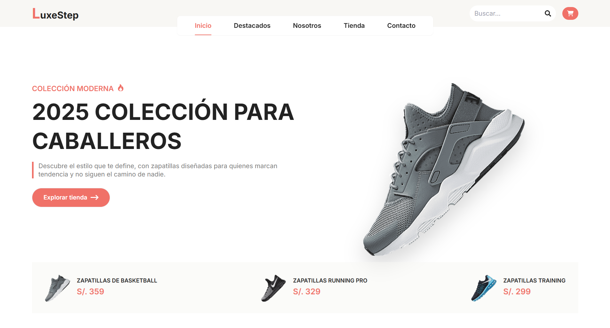

# LUXE-STEP 👟

[](https://luxe-step-inky.vercel.app/)

Bienvenido a **LUXE-STEP**, tu destino para encontrar las zapatillas perfectas que combinan estilo, comodidad y rendimiento. Desde modelos clásicos hasta los últimos lanzamientos, ofrecemos una selección premium para quienes marcan tendencia y nunca dejan de moverse. ¡Descubre tu próximo par favorito!

---

## 🌟 Características Principales

- 👟 **Catálogo variado** con las mejores marcas y modelos del mercado.
- 🎨 **Diseño moderno y atractivo**, pensado para una experiencia de compra fluida.
- 📱 **Interfaz responsive** que se adapta perfectamente a cualquier dispositivo.
- ✨ **Animaciones suaves** con Framer Motion que enriquecen la navegación.
- 🛒 **Carrito de compras** intuitivo y fácil de usar.
- ⚡ **Rendimiento optimizado** para una carga rápida y eficiente.

---

## ❓ ¿Por qué Luxe-Step?

El nombre **LUXE-STEP** representa la fusión perfecta entre **lujo** y **movimiento**. Cada paso que das merece calidad, estilo y la confianza de llevar un calzado que te impulse hacia tus metas.

Más que una tienda en línea, **LUXE-STEP** es un proyecto impulsado por la **pasión por el diseño** y el deseo de ofrecer **productos excepcionales** a quienes valoran tanto la estética como el rendimiento. Cada zapatilla disponible ha sido cuidadosamente **seleccionada** para garantizar una **experiencia de compra satisfactoria**.

**LUXE-STEP** — *Más que zapatillas, impulsamos cada paso hacia tus metas.*

---

## 🛠️ Tecnologías Utilizadas 👨‍💻

| HTML | CSS | JavaScript | React | Tailwind CSS | Vite | Node.js | Framer Motion |
|------|-----|------------|-------|--------------|------|---------|---------------|
|  |  |  |  |  |  |  |  |

---

## 🚀 Instalación y Uso Local

Sigue estos pasos para clonar y ejecutar el proyecto en tu máquina local:

1. **Clona el repositorio:**
```bash
   git clone https://github.com/carlossilvadev10/luxe-step.git
```

2. **Entra en el directorio del proyecto:**
```bash
   cd luxe-step
```

3. **Instala las dependencias necesarias:**
```bash
   npm install
```

4. **Ejecuta la aplicación en entorno de desarrollo:**
```bash
   npm run dev
```

5. **Abre tu navegador y visita:**
```bash
   http://localhost:5173
```

---

## 📩 Contacto

Si tienes alguna pregunta o sugerencia, puedes encontrarme en:

- 🌐 [Mi GitHub](https://github.com/carlossilvadev10)
- 📧 Email: [carlos.esilva1007@gmail.com](mailto:carlos.esilva1007@gmail.com)
- 💼 [Mi LinkedIn](https://www.linkedin.com/in/carlos-eduardo-silva-bustamante-b6084528b)

---

📌 *LUXE-STEP — Estilo y rendimiento en cada paso.*